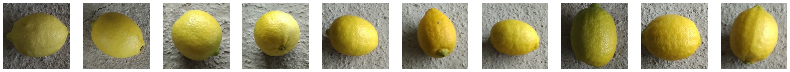

# Lemon Quality

Dataset source : https://www.kaggle.com/datasets/yusufemir/lemon-quality-dataset  
Deployment link : https://huggingface.co/spaces/grwyn/G7  

Name : Gerwyn Zulqarnain

The goal of this project is to develop a computer vision system to classify lemons as "good quality" or "bad quality" in order to streamline the lemon selection process in a juice manufacturing pipeline. By accurately identifying poor-quality lemons early in the process, the system will minimize waste and enhance product quality.

Using Keras’s Sequential API, I will:

1. Design and train three deep learning models with varying architectures to explore their performance and identify the best-performing model.
2. Perform data preprocessing on the provided folder containing images of good-quality and bad-quality lemons, including image augmentation to ensure a robust model capable of handling real-world variations.
3. Evaluate the models' performance using metrics such as accuracy, precision, recall, and F1-score, aiming for an accuracy of at least 81%.
4. Use a confusion matrix and other visualization tools to analyze misclassifications and refine the model further if necessary.
5. Ensure the development process is completed within one week, aligning with the implementation timeline for the manufacturing pipeline.
6. The system will serve as a scalable solution for automated quality control in juice manufacturing, with potential extensions for other fruit classification tasks in the future.

## Exploratory Data Analysis (EDA)

Lemons are one of the most popular and widely used fruits in the world, known for their bright yellow color, refreshing aroma, and tangy taste. They belong to the citrus family, alongside oranges, limes, and grapefruits. Lemons are a tropical and subtropical fruit, typically grown on small, thorny lemon trees. Native to Asia, they are now cultivated worldwide in warm climates, including countries like India, Mexico, and Italy.

### Good Quality Lemon

A good-quality lemon has a bright, vibrant yellow color, indicating ripeness and freshness. Its skin is smooth and uniform, with minimal to no blemishes or irregularities. The size is well-rounded or slightly oval, reflecting proper growth, and it maintains a consistent size, free from deformities or abnormalities. Overall, it is a visually appealing lemon that exudes quality and freshness, making it ideal for consumption or processing.

### Bad Quality Lemon

A bad-quality lemon typically has a dull or pale yellow color, sometimes with greenish or brownish patches, indicating immaturity or spoilage. Its skin is rough and uneven, often showing visible blemishes, scars, or spots caused by disease or pest damage. Mold, particularly around the stem area, is a clear sign of decay. The size is often irregular or distorted, reflecting poor growth conditions, and it may be smaller than average, suggesting underdevelopment. Overall, a bad-quality lemon is unappealing, lacks sufficient juice, may have off flavors, and contains defects that make it unsuitable for consumption or processing.

## Conclusion

### Model summary
Strengths:
1. Error-Free Execution:  
The model executes flawlessly without any runtime errors, ensuring stability during the training and testing process.
2. Efficiency in Execution Time:  
The model processes data relatively quickly, making it suitable for iterative improvements and testing within a short timeframe.

Weaknesses:
1. Low Accuracy:  
The current accuracy of the model is significantly below the acceptable threshold, making it unreliable for practical use in differentiating between good and bad quality lemons.
2. Insufficient Feature Learning:  
The model struggles to learn and extract meaningful features from the data, leading to poor classification performance. This may be due to suboptimal architecture, inadequate data preprocessing, or insufficient training.
3. Overfitting/Underfitting Potential:  
The gap between training and validation performance (if observed) could indicate overfitting or underfitting, requiring careful adjustments to the model or training process.
4. Data Limitations:  
If the dataset lacks sufficient diversity, the model may not generalize well to unseen images. Issues such as class imbalance, poor quality labels, or inadequate augmentation might also contribute to the low performance.

### Reccomendation

The first step to improving the model’s performance is to enhance its quality. Consider refining its architecture by experimenting with deeper or more complex layers, such as additional convolutional blocks or dropout layers, to better extract meaningful features and reduce overfitting. Implement advanced data preprocessing techniques, including image augmentation (e.g., rotation, scaling, and flipping) and normalization, to improve generalization and make the model more robust to variations in lemon quality. Optimize hyperparameters using methods like grid search or random search to identify the ideal learning rate, batch size, and number of epochs for training. Additionally, expand the dataset by collecting more labeled images of lemons with diverse qualities and environmental conditions to provide the model with a broader learning base and enhance its accuracy. Finally, incorporate evaluation metrics such as precision, recall, and F1-score to gain a comprehensive understanding of the model's classification performance and address any issues with class imbalances.